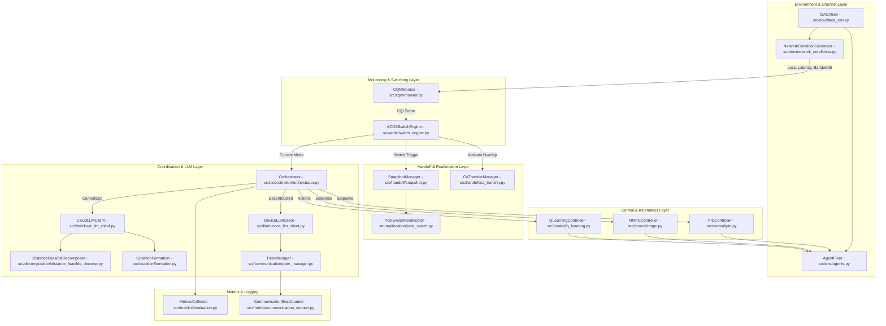
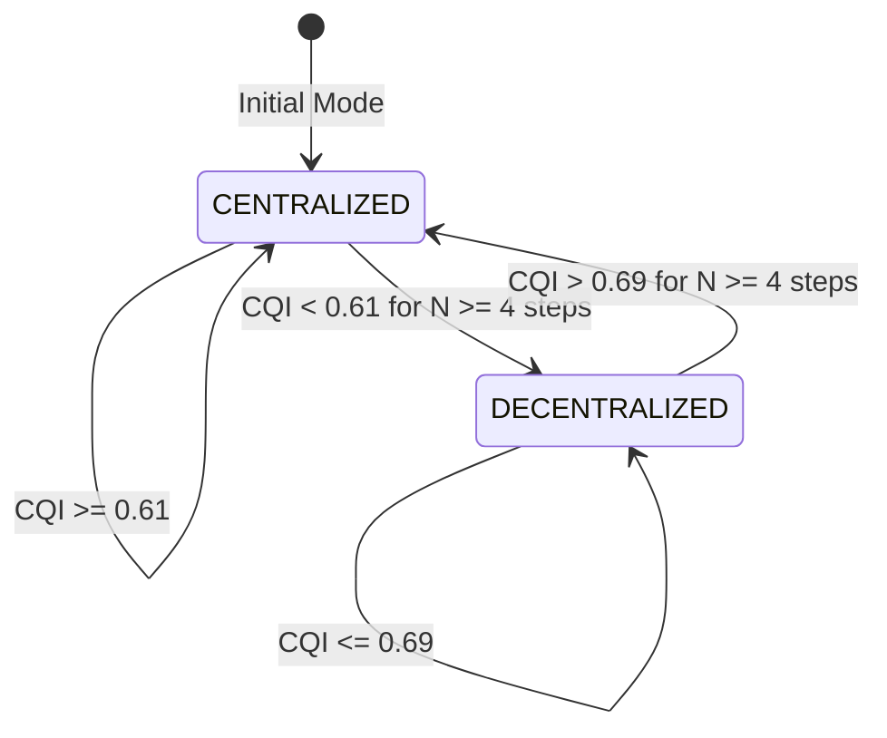

# DACA-HMAS

**Dynamic Architecture and Coalition Adaptation for Heterogeneous Multi-Agent Systems**

DACA-HMAS is a research software platform that provides dynamic, runtime architecture adaptation for heterogeneous multi-agent teams (unmanned aerial vehicles, ground vehicles, and ground robots) operating under degraded and fluctuating wireless communication channels. Building upon fixed-architecture LLM orchestrators (such as AutoHMA-LLM), DACA-HMAS continuously evaluates channel quality via a Communication Quality Index (CQI) computed from sliding-window packet loss, latency, and relative bandwidth. Based on CQI trends, an Adaptive Communication-Driven Switching (ACDS) state machine uses a threshold hysteresis band and persistence windowing to dynamically transition system control between Cloud-driven Centralized coordination and Edge Device-driven Decentralized coordination. To prevent task dropouts during transitions, DACA-HMAS combines distance-feasible task decomposition, spatial-and-skill-constrained coalition formation, state snapshot handoff with a context-aware overlap window, and post-switch task reallocation.

---

## 1. Research Problem & Motivation

Fixed-architecture multi-agent systems suffer from a fundamental trade-off:
1. **Centralized Architectures** (e.g., Cloud-driven LLM task allocators) achieve high global plan efficiency under clean network conditions. However, when wireless channels degrade (high packet loss, latency spikes, or intermittent disconnection), centralized control experiences catastrophic command failure, message drops, and excessive decision latency.
2. **Decentralized Architectures** (e.g., Edge Device-driven P2P consensus) offer resilience against network disconnections but incur high local communication overhead, suboptimal global task allocation, and heavy computational strain on resource-constrained edge devices.

Prior systems (such as AutoHMA-LLM) employ static control topologies chosen *a priori*. DACA-HMAS addresses this gap by treating system architecture as a dynamic control variable. By coupling real-time network channel monitoring with hysteresis-bounded state transitions, DACA-HMAS maintains centralized global reasoning when channels are clean ($CQI \ge 0.69$), seamlessly transitions to peer-to-peer edge coordination when channels degrade ($CQI \le 0.61$), and preserves mission continuity across transitions using structured state snapshot handoffs.

---

## 2. System Architecture

The DACA-HMAS pipeline integrates physical world simulation, network channel modeling, real-time quality monitoring, adaptive architecture switching, dual-tier LLM reasoning (Cloud vs. Edge Device), kinematic control, state handoff, and detailed metrics tracking.



### Subsystem Responsibilities

* **Environment & Channel Layer (`src/env/`):** Manages discrete timestep updates, 2D agent kinematic motion (`agents.py`), subtask lifecycle tracking (`daca_env.py`), and dynamic wireless channel simulation incorporating Rician fading, distance attenuation, and log-normal shadowing (`network_conditions.py`, `network_model.py`).
* **CQM Monitor (`src/cqm/monitor.py`):** Computes the scalar Channel Quality Index ($CQI \in [0, 1]$) at every timestep using sliding-window statistics of packet loss, latency, and relative bandwidth.
* **ACDS Switch Engine (`src/acds/switch_engine.py`):** Implements a state machine governing transitions between `CENTRALIZED` and `DECENTRALIZED` modes. Evaluates CQI against crossover thresholds using hysteresis margins and persistence windows ($N=4$).
* **Handoff & Reallocation (`src/handoff/`, `src/reallocation/`):** Captures serializable system snapshots (`snapshot.py`), manages context-aware overlap execution windows ($\Delta t = 3$ steps, `ca_transfer.py`), and re-assigns uncompleted subtasks to coalitions immediately following a mode switch (`post_switch.py`).
* **Coordination & LLM Layer (`src/coordination/`, `src/llm/`):** Drives global centralized planning via Cloud API integrations (`cloud_llm_client.py`), spatial task decomposition (`distance_feasible_decomp.py`), and coalition formation (`formation.py`). Drives decentralized peer coordination via Edge Device LLMs (`device_llm_client.py`) and peer consensus queues (`peer_manager.py`).
* **Control Layer (`src/control/`):** Translates high-level LLM allocations into low-level agent motion primitives using 2D PID trajectory tracking (`pid.py`), speed-clamped NMPC wrappers (`nmpc.py`), or tabular Q-Learning for local collision avoidance (`q_learning.py`).
* **Metrics Layer (`src/metrics/`):** Collects run-level statistics (success rates, completion steps, task/coalition failure rates) and step-level communication counters (message types, bytes, consensus rounds).

---

## 3. Repository Layout

```
DACA-HMAS/
├── src/
│   ├── acds/             # Adaptive Communication-Driven Switching state machine
│   ├── coalition/        # Spatial, skill, and efficiency coalition feasibility & formation
│   ├── communication/    # Message data structures, channels, and peer consensus routing
│   ├── control/          # Low-level trajectory tracking (PID, NMPC wrapper, Q-Learning)
│   ├── coordination/     # System orchestrator, centralized/decentralized modes, replan triggers
│   ├── cqm/              # Channel Quality Index (CQI) sliding-window monitor
│   ├── decomposition/    # Distance-feasible task decomposition algorithms
│   ├── env/              # Kinematics, agent fleet state, network fading models, scenario builders
│   ├── handoff/          # State snapshot capture, delta serialization, overlap transfer window
│   ├── llm/              # Cloud LLM client, Device LLM client, prompt templates, cache engine
│   ├── metrics/          # Metrics collector, communication step counters, significance testing
│   └── reallocation/     # Post-switch task and coalition re-assignment routines
├── configs/              # Global YAML configurations (thresholds.yaml, llm.yaml)
├── experiments/          # Canonical experiment runners, multi-seed validation suites, benchmark configs
├── tests/                # Pytest test suite covering CQM, ACDS, feasibility, handoff, determinism
├── baseline_results_compare/ # CSV benchmark comparison tables and paper trace matrices
└── scratch/              # Standalone analysis scripts, figure generators, verification reports
```

---

## 4. Execution Overview

Simulation runs are executed through `experiments/run_daca_hmas.py`, which instantiates `src/coordination/orchestrator.py`:

1. **Initialization:** `Orchestrator` loads global configurations from `configs/thresholds.yaml` and `configs/llm.yaml`, instantiates the specified scenario (e.g., `inspection`), builds the agent fleet (`AgentFleet`), initializes the network generator (`NetworkConditionGenerator`), and sets global random seeds (`random`, `np.random`).
2. **Timestep Execution Loop (`orchestrator.run_simulation()`):** For each step $t = 0 \dots T_{max}$:
   * **Network & CQI Evaluation:** `NetworkConditionGenerator.step()` updates packet loss, latency, and bandwidth. `CQMMonitor.update_from_network()` updates sliding-window averages and computes the scalar $CQI(t)$.
   * **ACDS Switch Decision:** `ACDSSwitchEngine.evaluate_switch(CQI)` evaluates whether $CQI$ has crossed switching thresholds for $N=4$ consecutive steps. If a switch occurs (e.g., `CENTRALIZED -> DECENTRALIZED`):
     * `SnapshotManager.capture_snapshot()` serializes active agent states, subtask progress, and coalition maps.
     * `PostSwitchReallocator.reallocate()` re-assigns uncompleted subtasks under the new mode.
     * `CATransferManager.activate_overlap_window()` initiates a $\Delta t = 3$ step dual-controller overlap period.
   * **Coordination & Planning Branch:**
     * **`CENTRALIZED` Mode:** `CentralizedHybridCoordinator` checks if replanning is triggered (`replan_trigger.py`). If triggered, `CloudLLMClient` decomposes tasks (`distance_feasible_decomp.py`) and forms coalitions (`formation.py`). Target setpoints are passed to `PIDController` or `NMPCController`.
     * **`DECENTRALIZED` Mode:** `DecentralizedHybridCoordinator` invokes `DeviceLLMClient` on domain leaders. Leaders negotiate task sharing over `PeerManager` consensus queues. Local actions are computed using `QLearningController` or `PIDController`.
   * **Physical Simulation Step:** `DACAEnv.step_agents_toward_targets()` updates agent positions based on computed velocity commands, enforces speed limits, checks subtask target reachability ($d \le C_2$), and updates completion states.
   * **Metrics Logging:** `CommunicationStepCounter` records message volumes, bytes, and message types (`MessageType`). `MetricsCollector` logs step data.
3. **Termination:** Upon mission completion or reaching $T_{max}$, `MetricsCollector.finalize()` aggregates statistics and exports JSON and CSV logs to `experiments/`.

---

## 5. Scenarios & Environment

### Implemented Scenario Benchmarks (`src/env/scenarios.py`)

| Scenario | UAV Count | Vehicle Count | Robot Count | Total Agents | Total Subtasks | Baseline Delay Prob | Baseline Loss Rate |
| :--- | :--- | :--- | :--- | :--- | :--- | :--- | :--- |
| `logistics` | 3 | 2 | 2 | 7 | 6 | 0.00 | 0.000 |
| `inspection` | 4 | 2 | 3 | 9 | 8 | 0.10 | 0.010 |
| `search_rescue` | 5 | 3 | 4 | 12 | 10 | 0.05 | 0.005 |

### Coordinate System & Simulation Semantics
* **World Model:** Continuous 2D Cartesian plane $(x, y) \in \mathbb{R}^2$.
* **Timestep Semantics:** Discrete simulation step model with fixed timestep $\Delta t = 1.0\text{s}$.
* **Determinism Guarantee:** Explicit seeding of Python `random.seed(seed)` and NumPy `np.random.seed(seed)` during environment reset (`src/env/daca_env.py`). Re-verified via `tests/test_determinism_audit.py`.

### Implemented Network Profiles (`src/env/network_conditions.py`)

| Profile Name | Description & Governing Mechanism |
| :--- | :--- |
| `stable` | Clean, static channel conditions ($Loss = 0.01$, $Latency = 0.02\text{s}$, $BW = 10.0\text{ Mbps}$). |
| `gradual` | Linear degradation of channel quality over $t = 0 \dots 200$ timesteps. |
| `sudden` | Discrete step-function network drop at step $t=50$, raising loss to $0.45$. |
| `oscillatory` | Sinusoidal channel quality fluctuation with a macro-oscillation period of 60 timesteps. |

---

## 6. Core Mechanisms

### 6.1 Communication Quality Index (CQI)
`src/cqm/monitor.py`

Computes a normalized channel quality score $CQI(t) \in [0.0, 1.0]$:

$$CQI(t) = 1.0 - \left( w_1 \cdot \bar{L}_{loss}(t) + w_2 \cdot \frac{\bar{\tau}(t) - \tau_{min}}{\tau_{max} - \tau_{min}} + w_3 \cdot \left(1.0 - \frac{\bar{B}(t)}{B_{max}}\right) \right)$$

* **Tuning Parameters (`configs/thresholds.yaml`):**
  * Weights: $w_1 = 0.4$ (`cqi_weights.w1`), $w_2 = 0.35$ (`cqi_weights.w2`), $w_3 = 0.25$ (`cqi_weights.w3`).
  * Normalization bounds: $\tau_{min} = 0.01\text{s}$, $\tau_{max} = 2.0\text{s}$.
  * Window sizes: Loss window $W_B = 20$ steps (`packet_loss_window`), Bandwidth window = 10 steps.

---

### 6.2 Adaptive Communication-Driven Switching (ACDS)
`src/acds/switch_engine.py`

ACDS prevents switching chatter over degraded channels using a hysteresis band $\delta = 0.04$ around crossover threshold $\gamma_{cross} = 0.65$ combined with a persistence window of $N = 4$ steps:

$$\text{Mode}(t) = \begin{cases} \text{DECENTRALIZED}, & \text{if } CQI(t) < (\gamma_{cross} - \delta) = 0.61 \text{ for } N \ge 4 \text{ consecutive steps} \\ \text{CENTRALIZED}, & \text{if } CQI(t) > (\gamma_{cross} + \delta) = 0.69 \text{ for } N \ge 4 \text{ consecutive steps} \\ \text{Mode}(t-1), & \text{otherwise} \end{cases}$$



---

### 6.3 Distance-Feasible Coalition Formation
`src/coalition/formation.py`, `src/coalition/feasibility.py`

Coalitions aggregate heterogeneous agents to fulfill multi-skill subtasks while satisfying spatial reach and communication distance constraints:

1. **Spatial Communication Feasibility:**
   $$\forall a_i, a_j \in \mathcal{C}_k, \quad \| \mathbf{p}_i - \mathbf{p}_j \|_2 \le C_1 = 50.0\text{m}$$
2. **Skill Coverage Inclusion:**
   $$\bigcup_{a_i \in \mathcal{C}_k} \text{Skills}(a_i) \supseteq \text{RequiredSkills}(\tau_k)$$
3. **Coalition Efficiency Bound:**
   $$\gamma(\mathcal{C}_k) = \frac{|\text{RequiredSkills}(\tau_k)|}{\sum_{a_i \in \mathcal{C}_k} |\text{Skills}(a_i)|} \ge \gamma_{min} = 0.3$$

---

### 6.4 State Snapshot Handoff & Overlap Transfer
`src/handoff/snapshot.py`, `src/handoff/ca_transfer.py`

When an ACDS switch occurs, `SnapshotManager` captures an `AgentSnapshot` for each agent and bundles them into a `GlobalSnapshot` containing positions, active subtask states, coalition topologies, and LLM plan caches. To prevent transient trajectory divergence, `CATransferManager` executes a Context-Aware (CA) overlap transfer period of $\Delta t = 3$ timesteps (`ca_overlap_delta`), during which previous and new controller setpoints are blended.

---

### 6.5 Post-Switch Reallocation
`src/reallocation/post_switch.py`

Immediately following an architecture switch, `PostSwitchReallocator` parses the restored state snapshot. Uncompleted subtasks are identified, distance-feasibility bounds are re-evaluated against current agent positions, and local domain leaders (in Decentralized mode) or Cloud LLMs (in Centralized mode) re-assign agent coalitions to remaining targets.

---

## 7. LLM Planning System

### Cloud LLM vs Edge Device LLM Client

* **Cloud LLM Client (`src/llm/cloud_llm_client.py`):** Invoked in `CENTRALIZED` mode for global task decomposition and initial coalition formation. Configured via `configs/llm.yaml` to use OpenAI/NVIDIA API endpoints (`meta/llama-3.1-8b-instruct`).
* **Device LLM Client (`src/llm/device_llm_client.py`):** Invoked in `DECENTRALIZED` mode on local domain leader agents. Configured to interface with local vLLM or Ollama instances (`Qwen/Qwen2.5-3B-Instruct`).

### Prompt Template Inventory (`src/llm/prompts/`)

| Prompt File | Intended Purpose & Functionality |
| :--- | :--- |
| `decomposition.txt` | Instructs Cloud LLM to break high-level missions into distance-feasible subtasks. |
| `coalition.txt` | Prompts Cloud LLM to form skill-matched agent coalitions under spatial constraints. |
| `plan_local.txt` | Requests local trajectory setpoints from Edge Device LLMs for domain-assigned subtasks. |
| `dispatch.txt` | Generates central task dispatch directives for assigned agent fleets. |
| `coordinate.txt` | Coordinates intra-domain agent ordering and collision avoidance setpoints. |
| `merge_peer_plan.txt` | Merges peer proposal plans into a unified local domain plan during consensus. |
| `reallocate.txt` | Formulates post-switch task re-assignments for uncompleted subtasks. |
| `respond_to_peer.txt` | Generates peer-to-peer negotiation responses during edge consensus rounds. |
| `review_peer_plan.txt` | Evaluates proposed peer agent subtask allocations for skill or distance conflicts. |

### Parse Failure & Hallucination Recovery
If an LLM completion contains malformed JSON or invalid schema structures, `CloudLLMClient._extract_labeled_json()` catches the exception, logs a hallucination error (`hallucination_rate`), and triggers deterministic rule-based fallback heuristics (`_mock_decomposition` / `_mock_coalition`). Re-verified via `tests/test_hallucination_recovery.py`.

### Prompt & Plan Caching
`src/llm/cache_engine.py` hashes rendered prompts and environment states using MD5. Re-computation is bypassed if state cosine similarity exceeds $0.85$ (`planning_similarity_threshold`) and the cached plan age is less than 15 steps (`maximum_cached_plan_age`).

---

## 8. Control Layer

1. **2D PID Trajectory Controller (`src/control/pid.py`):** Implements proportional-integral-derivative feedback control to drive agent position $(x,y)$ toward setpoint positions:
   $$\mathbf{u}(t) = K_p \mathbf{e}(t) + K_i \int_0^t \mathbf{e}(\tau)d\tau + K_d \frac{d\mathbf{e}(t)}{dt}$$
2. **Speed-Clamped NMPC Wrapper (`src/control/nmpc.py`):** `NMPCController` wraps `PIDController` for position tracking, applying non-linear magnitude clamping to enforce maximum agent speed constraints ($\|\mathbf{u}\|_2 \le v_{max}$).
3. **Tabular Q-Learning (`src/control/q_learning.py`):** Used in decentralized mode for local agent target selection and collision avoidance:
   $$Q(s, a) \leftarrow Q(s, a) + \alpha \left[ r + \gamma \max_{a'} Q(s', a') - Q(s, a) \right]$$

---

## 9. Communication Layer

### Implemented Message Types (`src/communication/models.py`)

| MessageType Enum | Description & Flow Trigger |
| :--- | :--- |
| `GLOBAL_PLAN` | Cloud LLM global plan broadcast to domain leaders. |
| `DISPATCH` | Centralized task assignment dispatch to individual agents. |
| `LOCAL_COORD` | Intra-domain peer state coordination message. |
| `PEER_CONSENSUS` | Iterative peer consensus negotiation message. |
| `FEEDBACK_SYNC` | Status and completion feedback returned to Cloud. |
| `HANDOFF` | State snapshot payload transmitted during ACDS switch. |
| `BROADCAST` | General domain-wide broadcast message. |
| `P2P` | Direct point-to-point peer message between adjacent nodes. |

### Communication Metrics Tracking
Every message processed by `PeerManager` updates `CommunicationStepCounter` (`src/metrics/communication_counter.py`), logging `total_messages`, `total_bytes`, `peer_messages`, `broadcast_count`, and `consensus_rounds`. These counters quantify the exact network bandwidth overhead savings achieved by switching to decentralized peer communication during network degradation.

---

## 10. Configuration Reference

### Key Parameters: `configs/thresholds.yaml`

| Parameter Key | Default Value | Description |
| :--- | :--- | :--- |
| `C1` | `50.0` | Maximum spatial communication range in meters. |
| `C_task` | `30.0` | Subtask collaboration radius in meters. |
| `R_reach` | `100.0` | Maximum reach radius from agent to subtask target in meters. |
| `C2` | `5.0` | Collision avoidance safety threshold radius in meters. |
| `cqi_weights.w1` | `0.4` | CQI weight for packet loss rate. |
| `cqi_weights.w2` | `0.35` | CQI weight for latency. |
| `cqi_weights.w3` | `0.25` | CQI weight for relative bandwidth. |
| `latency.tau_min` | `0.01` | Minimum baseline latency bound in seconds. |
| `latency.tau_max` | `2.0` | Maximum latency saturation limit in seconds. |
| `packet_loss_window` | `20` | Sliding window size ($W_B$) for packet loss averaging. |
| `acds.cqi_crossover` | `0.65` | Nominal CQI crossover threshold for ACDS switching. |
| `acds.delta` | `0.04` | Hysteresis half-width margin ($\delta$). |
| `acds.persistence_window` | `4` | Persistence window ($N$) in consecutive timesteps. |
| `gamma_min` | `0.3` | Minimum coalition efficiency bound ($\gamma_{min}$). |
| `ca_overlap_delta` | `3` | Context-aware handoff overlap window in steps ($\Delta t$). |
| `battery.enabled` | `false` | Master toggle flag for movement battery drain model. |

### Key Parameters: `configs/llm.yaml`

| Parameter Key | Default Value | Description |
| :--- | :--- | :--- |
| `cloud.provider` | `nvidia` | Cloud LLM backend provider (`nvidia` or `groq`). |
| `cloud.model` | `meta/llama-3.1-8b-instruct` | Cloud LLM model identifier string. |
| `cloud.temperature` | `0.2` | Cloud completion sampling temperature. |
| `cloud.max_tokens` | `1024` | Maximum token completion limit for Cloud LLM. |
| `cloud.timeout` | `420` | HTTP request timeout in seconds. |
| `device.provider` | `vllm` | Edge Device LLM provider (`vllm` or `ollama`). |
| `device.model` | `Qwen/Qwen2.5-3B-Instruct` | Edge Device LLM model identifier string. |
| `device.max_tokens` | `200` | Token output cap for Edge Device LLM completions. |
| `use_mock` | `false` | Master toggle to use deterministic rule-based mock engine. |
| `cache_responses` | `true` | Enables persistent disk caching of LLM completions. |

> **Configuration Callout:** `configs/thresholds.yaml` contains duplicate key declarations for `acds.delta` on lines 18 and 19. The YAML parser overwrites the duplicate entry without runtime error.

---

## 11. Metrics & Evaluation

### Comprehensive Metric Inventory (`src/metrics/evaluation.py`)

| Metric Identifier | Formula / Definition | Log Export Target |
| :--- | :--- | :--- |
| `success_rate` | $\frac{\text{Completed Subtasks}}{\text{Total Subtasks}}$ | CSV / JSON summary outputs |
| `steps` | Total timesteps executed ($\sum t$) | CSV / JSON summary outputs |
| `total_tokens` | $\sum (\text{Prompt Tokens} + \text{Completion Tokens})$ | CSV / JSON summary outputs |
| `api_calls` | Total external LLM requests executed | CSV / JSON summary outputs |
| `switch_count` | Total ACDS architecture mode switches | CSV / JSON summary outputs |
| `peer_messages` | Count of point-to-point peer messages (`P2P`) | CSV / JSON summary outputs |
| `broadcast_count` | Count of global domain broadcast messages (`BROADCAST`) | CSV / JSON summary outputs |
| `consensus_rounds` | Total peer consensus negotiation rounds executed | CSV / JSON summary outputs |
| `TFR` | Task Failure Rate: $\frac{\text{Failed Subtasks}}{\text{Total Subtasks}}$ | CSV / JSON summary outputs |
| `CFR` | Coalition Failure Rate: $\frac{\text{Invalid Coalitions}}{\text{Total Formed}}$ | CSV / JSON summary outputs |
| `hallucination_rate` | $\frac{\text{Failed LLM JSON Parses}}{\text{Total LLM Calls}}$ | CSV / JSON summary outputs |

Experiment scripts in `experiments/` process these metrics via `MetricsCollector.aggregate_by_config()` to generate summary statistical tables (`summary_statistics.csv`) and significance tests (`statistical_significance_results.csv`).

---

## 12. Running the Project

### Prerequisites & Installation

```bash
# Clone the repository
git clone https://github.com/Sid62/DACA-HMAS-Dynamic-Adaptive-Communication-Aware-Heterogeneous-Multi-Agent-System.git
cd DACA-HMAS-Dynamic-Adaptive-Communication-Aware-Heterogeneous-Multi-Agent-System

# Create virtual environment and install requirements
python -m venv venv
source venv/bin/activate  # Linux/macOS
# or venv\Scripts\activate # Windows

pip install -r requirements.txt
```

### Environment Configuration & Mock Execution Mode

To run using live Cloud LLMs, set your API key environment variable:
```bash
export NVIDIA_API_KEY="your_nvidia_api_key_here"
```

To run offline without external API keys, set `use_mock: true` in `configs/llm.yaml` or pass mock flags in script invocation:
```yaml
# configs/llm.yaml
use_mock: true
```

### Running Benchmark Experiments

```bash
# Run canonical DACA-HMAS experiment (A5 configuration under gradual network profile)
python experiments/run_daca_hmas.py

# Run static centralized baseline experiment (AutoHMA baseline)
python experiments/run_baseline_autohma.py

# Run comprehensive multi-seed validation sweep
python experiments/run_comprehensive_validation.py
```

### Running the Test Suite

```bash
# Execute unit and integration tests with pytest
pytest tests/
```

---

## 13. Comparison to Prior Work & Base Paper Claims

| Paper Claim / Feature | Implementation Status | Implementation Evidence & Notes |
| :--- | :--- | :--- |
| **CQI-Driven Architecture Switching (ACDS)** | Fully Implemented | `src/acds/switch_engine.py:36-58` — Hysteresis and persistence window switching verified. |
| **Distance-Feasible Task Decomposition** | Fully Implemented | `src/decomposition/distance_feasible_decomp.py:103-163` — Enforces reach bounds $R_{reach}$. |
| **Context-Aware Overlap Handoff** | Fully Implemented | `src/handoff/ca_transfer.py:22-52` — $\Delta t = 3$ step overlap transfer verified. |
| **Real-Time NMPC Control** | Simplified | `src/control/nmpc.py:30-55` — Implemented as speed-clamped PID wrapper. |
| **Movement Battery Model** | Disabled by Default | `src/env/agents.py:70-84` — Code present, but `battery.enabled: false` in config. |

---

## 14. Known Limitations & Technical Caveats

1. **Simplified NMPC Controller:** The NMPC module (`src/control/nmpc.py`) does not execute an iterative non-linear solver (e.g., CasADi). It wraps the 2D PID controller with analytical speed-saturation clamping.
2. **Disabled Battery Mechanics:** Battery consumption logic exists in `src/env/agents.py`, but `battery.enabled` defaults to `false` in `configs/thresholds.yaml`. Agent battery levels remain static unless explicitly enabled.
3. **2D Kinematic Simplification:** Agent motion is modeled strictly in the 2D Cartesian plane $(x, y)$. UAV altitude $(z)$ kinematics and 3D aerodynamics are not modeled.
4. **Simulated Communication Payloads:** Network message passing is evaluated logically using Python dictionaries. Real network socket serialization (TCP/UDP) is not implemented.
5. **Single-Threaded Execution:** The simulation loop in `orchestrator.py` operates synchronously on a single thread. Edge device LLM calls are evaluated sequentially rather than concurrently across physical nodes.

---

## 15. Technical Audit & Deep-Dive Reference

For exhaustive, line-by-line code citations, mathematical derivations, complete AST import graphs, and detailed trace matrices, refer to the self-contained audit report:

* **File Location:** `scratch/generate_ieee_reviewer_verification_report.py` (and generated audit markdown packages under `scratch/`).
